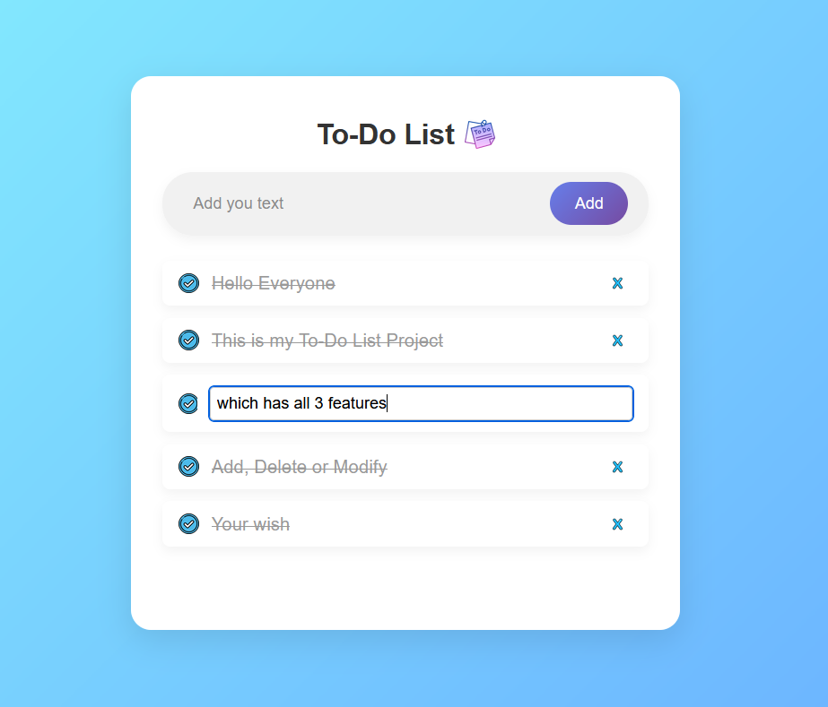

# 📝 To-Do List Web App

 
A clean and simple **To-Do List** built using **HTML, CSS, and JavaScript**. This project lets users add, check, delete, edit, and persist their tasks using local storage.

## 🚀 Features

  

- ✅ Add new tasks

- ✅ Mark tasks as completed

- ✅ Delete tasks with a cross icon

- ✅ Edit tasks on double-click

- ✅ Responsive and modern UI

- ✅ Tasks are saved in **localStorage** (data persists after refresh)

  

  

## 📸 Screenshot

  

  

  

## 🛠️ Technologies Used

  

- HTML5

- CSS3

- JavaScript (Vanilla)

- localStorage API

  

## ✍️ How to Use

1.  Clone or download the repository.
    
2.  Open `index.html` in any browser.
    
3.  Start adding your tasks!

## 👨‍💻 Author

-   Created by Gungun Soni
    
-   GitHub: [inosgungun](https://github.com/inosgungun)
